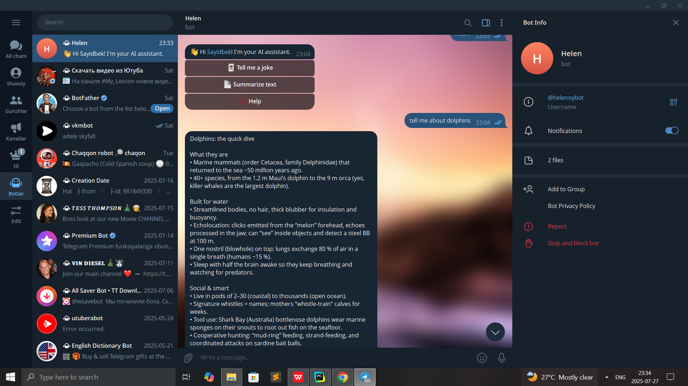
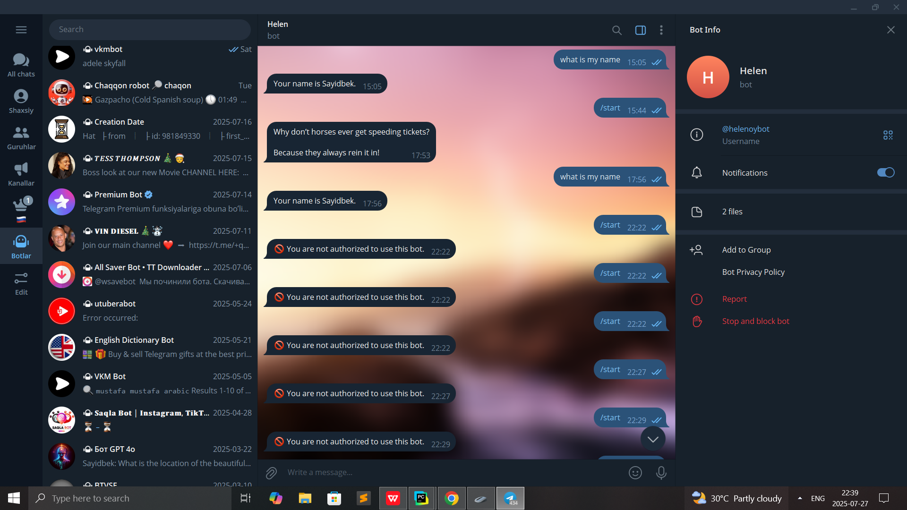
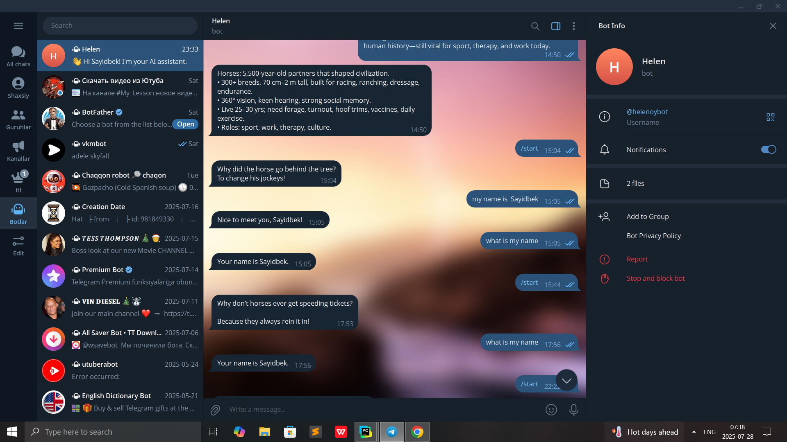
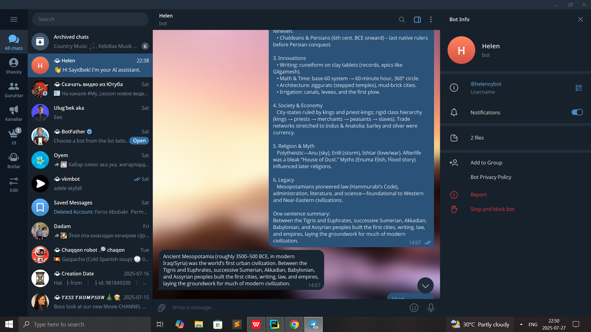
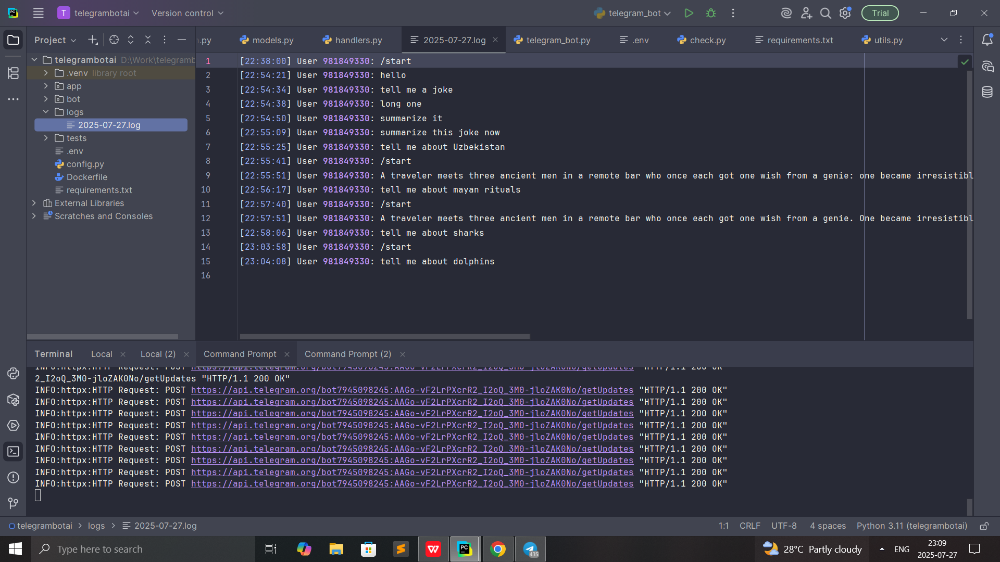
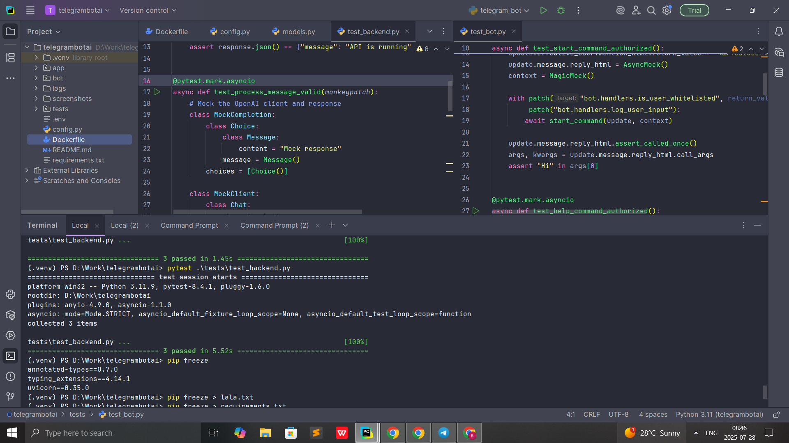
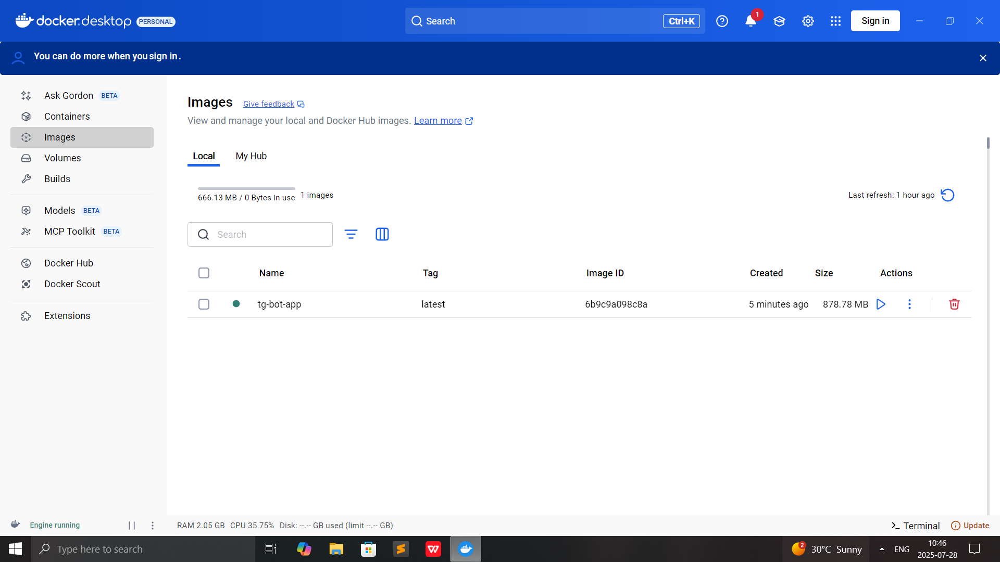

# 🤖 Telegram AI Assistant Bot with FastAPI Backend

Goal: Build a Telegram-integrated AI agent to handle user requests via backend intelligence.
Tasks
Telegram Bot Integration
Set up a Telegram bot.
Handle user message input, commands, and callbacks.
Secure bot token and manage access control (e.g., whitelisting users).
Backend AI Agent
Design a Python backend service using FastAPI.
Integrate an AI agent (e.g., OpenAI GPT, custom NLP model) to process and respond to queries.
Implement conversation context handling (session-based or persistent memory).
Communication Layer
Use async messaging or REST API between Telegram bot and AI backend.
Handle retries, error logging, and timeout logic gracefully.
Features
Support for natural language Q&A, summaries, and task automation.
Logging of all conversations for debugging and analytics.
Deployment & Testing
Containerize app using Docker.
Write unit and integration tests.
### 1. Message Processing
For processing messages from chat I used [`moonshotai/Kimi-K2-Instruct:novita`](https://huggingface.co/moonshotai/Kimi-K2-Instruct)
from Hugging Face, it is a great model for generating conversational responses.

### 2. Text Summarization
For summarization of text [`facebook/bart-large-cnn`](https://huggingface.co/facebook/bart-large-cnn) was used which is
a great Hugging Face model for generating concise and accurate summaries from long paragraphs.


---

## 📁 Project Structure
```
├── app/
│   ├── main.py              # FastAPI application (chat & summarization endpoints)
│   ├── models.py            # Pydantic models for API
│   └── config.py            # Environment/config management
│
├── bot/
│   ├── telegram_bot.py      # Telegram bot entry point
│   ├── handlers.py          # Bot handlers (commands, messages, callbacks)
│   └── utils.py             # Whitelisting, logging
│
├── tests/
│   ├── test_backend.py      # FastAPI unit tests
│   └── test_bot.py          # Telegram bot unit tests
│
├── Dockerfile               # Docker setup
├── requirements.txt         # Python dependencies
├── screenshots              # Pics   
└── README.md                # Project overview
```


## Graphical Part of Task






**Whitelist support**: Only approved users can interact with the bot. Their Telegram IDs are stored and at the beginning
of chat it is checked whether or not user is approved.



Session-based memory last 10 messages of per user are stored for maintaining conversation context.
GPT models have a token limit thus storing only the last 10 messages keeps context small but relevant, balancing memory with performance and cost.




Here we can see summary of long text given above is provided



All users conversations are stored in log file


Unit tests have been written for testing bot and fastapi backend which passed tests with success


`docker build -t tg-bot-app .`


`docker run -p 8000:8000 --env-file .env tg-bot-app`



Image in Docker Desktop